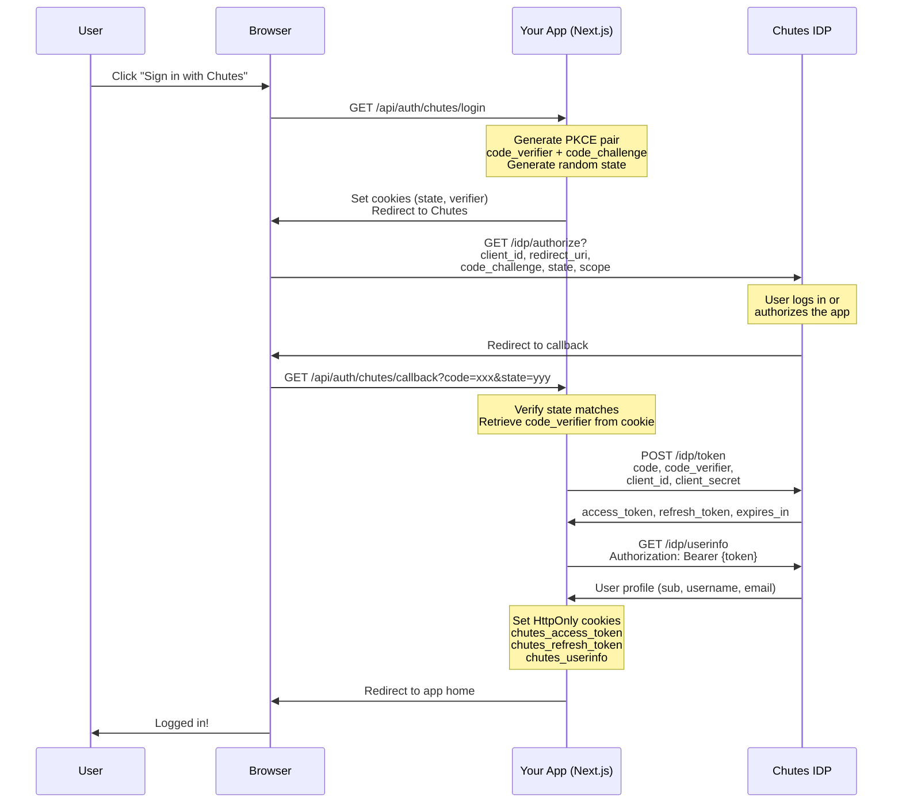

# Sign in with Chutes - Architecture

This document explains the OAuth 2.0 + PKCE authentication flow used by "Sign in with Chutes".

## Overview

Chutes uses OAuth 2.0 with PKCE (Proof Key for Code Exchange) for secure authentication. This is the same flow used by major identity providers like Google, GitHub, and Auth0.

### Key Components

| Component          | URL                                                      | Description              |
| ------------------ | -------------------------------------------------------- | ------------------------ |
| IDP Base URL       | `https://api.chutes.ai`                                  | Chutes Identity Provider |
| Authorize Endpoint | `/idp/authorize`                                         | Start OAuth flow         |
| Token Endpoint     | `/idp/token`                                             | Exchange code for tokens |
| UserInfo Endpoint  | `/idp/userinfo`                                          | Get user profile         |
| OpenID Config      | `https://idp.chutes.ai/.well-known/openid-configuration` | Discovery document       |

---

## Authentication Flow



---

## PKCE (Proof Key for Code Exchange)

PKCE prevents authorization code interception attacks. Here's how it works:

### 1. Generate Code Verifier

A cryptographically random string (32+ bytes, base64url encoded):

```typescript
const verifier = crypto.randomBytes(32).toString("base64url");
// Example: "dBjftJeZ4CVP-mB92K27uhbUJU1p1r_wW1gFWFOEjXk"
```

### 2. Generate Code Challenge

SHA256 hash of the verifier, base64url encoded:

```typescript
const hash = crypto.createHash("sha256").update(verifier).digest();
const challenge = hash.toString("base64url");
// Example: "E9Melhoa2OwvFrEMTJguCHaoeK1t8URWbuGJSstw-cM"
```

### 3. Authorization Request

Send the **challenge** (not the verifier) to the authorize endpoint:

```
/idp/authorize?code_challenge=E9Melhoa2OwvFrEMTJguCHaoeK1t8URWbuGJSstw-cM&code_challenge_method=S256
```

### 4. Token Exchange

Send the **verifier** when exchanging the code for tokens:

```
POST /idp/token
code_verifier=dBjftJeZ4CVP-mB92K27uhbUJU1p1r_wW1gFWFOEjXk
```

The server hashes the verifier and compares it to the stored challenge—if they match, the token is issued.

---

## State Parameter

The `state` parameter prevents CSRF attacks:

1. Generate a random string before redirecting to the IDP
2. Store it in an HttpOnly cookie
3. Compare the returned `state` to the stored value in the callback
4. Reject the request if they don't match

```typescript
const state = crypto.randomBytes(16).toString("hex");
// Example: "a1b2c3d4e5f6g7h8i9j0k1l2m3n4o5p6"
```

---

## Token Storage

Tokens are stored in **HttpOnly cookies** for security:

| Cookie                 | Purpose               | Lifetime                    |
| ---------------------- | --------------------- | --------------------------- |
| `chutes_access_token`  | API authentication    | ~1 hour (from `expires_in`) |
| `chutes_refresh_token` | Get new access tokens | 30 days                     |
| `chutes_userinfo`      | Cached user profile   | Same as access token        |

### Cookie Security Settings

```typescript
{
  httpOnly: true,      // Not accessible via JavaScript
  secure: true,        // HTTPS only in production
  sameSite: "lax",     // CSRF protection
  path: "/",           // Available to all routes
}
```

---

## Token Refresh

When the access token expires, use the refresh token to get a new one:

```typescript
const response = await fetch("https://api.chutes.ai/idp/token", {
  method: "POST",
  headers: { "Content-Type": "application/x-www-form-urlencoded" },
  body: new URLSearchParams({
    grant_type: "refresh_token",
    refresh_token: storedRefreshToken,
    client_id: process.env.CHUTES_OAUTH_CLIENT_ID,
    client_secret: process.env.CHUTES_OAUTH_CLIENT_SECRET,
  }),
});

const { access_token, refresh_token, expires_in } = await response.json();
```

---

## API Routes Structure

The Next.js implementation uses four API routes:

### `/api/auth/chutes/login` (GET)

- Generates PKCE pair and state
- Sets temporary cookies
- Redirects to Chutes authorize URL

### `/api/auth/chutes/callback` (GET)

- Receives the authorization code
- Validates state parameter
- Exchanges code for tokens
- Fetches user info
- Sets session cookies
- Redirects to app home

### `/api/auth/chutes/session` (GET)

- Returns current session state
- Used by the `useChutesSession` hook
- Returns `{ signedIn: true, user: {...} }` or `{ signedIn: false }`

### `/api/auth/chutes/logout` (POST)

- Clears all session cookies
- Returns `{ ok: true }`

---

## Scopes Reference

| Scope                      | Description           | Use Case            |
| -------------------------- | --------------------- | ------------------- |
| `openid`                   | Required for OIDC     | Always include      |
| `profile`                  | Username, email, name | User display        |
| `chutes:invoke`            | Make API calls        | AI features         |
| `chutes:invoke:{chute_id}` | Invoke specific chute | Fine-grained access |
| `account:read`             | Account information   | Profile pages       |
| `billing:read`             | Credits/balance       | Usage display       |

---

## Registering an OAuth App

Use the Chutes API to register your OAuth app:

```bash
curl -X POST "https://api.chutes.ai/idp/apps" \
  -H "Authorization: Bearer $CHUTES_API_KEY" \
  -H "Content-Type: application/json" \
  -d '{
    "name": "My App",
    "description": "My awesome app",
    "redirect_uris": ["http://localhost:3000/api/auth/chutes/callback"],
    "homepage_url": "http://localhost:3000",
    "allowed_scopes": ["openid", "profile", "chutes:invoke"]
  }'
```

Response:

```json
{
  "app_id": "b4...",
  "client_id": "cid_xxx",
  "client_secret": "csc_xxx",
  "name": "My App",
  "redirect_uris": ["http://localhost:3000/api/auth/chutes/callback"],
  "active": true,
  "public": true
}
```

---

## Security Considerations

1. **Never expose `client_secret`** - Keep it server-side only
2. **Use HttpOnly cookies** - Prevents XSS token theft
3. **Validate state parameter** - Prevents CSRF attacks
4. **Use PKCE** - Prevents authorization code interception
5. **HTTPS in production** - Secure cookie transmission
6. **Short-lived access tokens** - Minimize exposure window

---

## Debugging Tips

### Check the OpenID Configuration

```bash
curl https://idp.chutes.ai/.well-known/openid-configuration | jq .
```

### Verify Your App Registration

```bash
curl https://api.chutes.ai/idp/apps \
  -H "Authorization: Bearer $CHUTES_API_KEY" | jq .
```

### Test Token Exchange Manually

```bash
curl -X POST https://api.chutes.ai/idp/token \
  -d "grant_type=authorization_code" \
  -d "code=YOUR_CODE" \
  -d "redirect_uri=YOUR_REDIRECT_URI" \
  -d "client_id=YOUR_CLIENT_ID" \
  -d "client_secret=YOUR_CLIENT_SECRET" \
  -d "code_verifier=YOUR_VERIFIER"
```
